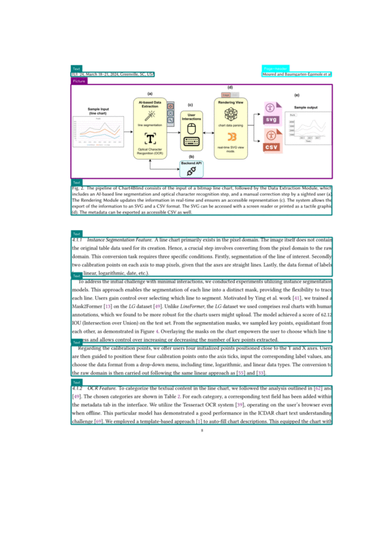

<div align="center">

<h3 align="center">YOLOv11 - Document Layout Analysis</h3>
</div>

<p align="center">
  <a href="https://huggingface.co/spaces/omoured/YOLOv11-Document-Layout-Analysis">
    
  </a>
  &nbsp;
  <a href="https://colab.research.google.com/github/moured/YOLOv11-Document-Layout-Analysis/blob/main/demo.ipynb">
    
  </a>
</p>

<p align="center">
  For further assistance or adaptation in your project, feel free to get in touch: <a href="mailto:moured.omar@gmail.com">moured.omar@gmail.com</a>.
</p>

<!--
  <p align="center">
    Trained on DocLayNet dataset
    <br />
    <a href="https://huggingface.co/spaces/linhdo/document-layout-analysis">Live HuggingFace Demo</a>
    ·
    <a href="https://github.com/THU-MIG/yolov10">Visit YOLOv10</a>
    ·
    <a href="https://github.com/LynnHaDo/Document-Layout-Analysis/issues">Request Feature or Report Problem</a>
  </p>
</div>
-->

## Updates 🔥

I have trained YOLOv11 on the DocLayNet dataset for this project. Below is the results table. Feel free to use our fine-tuned models, and please remember to cite YOLOv11, DocLayNet, and our repository. If you find this repository useful, don't forget to give it a 🌟!

- **02/11/2024**: 🚀 Uploaded Weights (check the table below).
- **01/11/2024**: 🤗 HuggingFace demo is live with YOLOv11-x fine-tuned weights.

<!-- ABOUT THE PROJECT -->
## About 📋

The models were fine-tuned using 4xA100 GPUs on the Doclaynet-base dataset, which consists of 69103 training images, 6480 validation images, and 4994 test images. We also maintain the same number of classes and order.

**Classes:**  
**0:** Caption, **1:** Footnote, **2:** Formula, **3:** List-item, **4:** Page-footer, **5:** Page-header, **6:** Picture, **7:** Section-header, **8:** Table, **9:** Text, **10:** Title

<p align="center">
  
</p>

## Results 📊
| Model   | mAP50 | mAP50-95 | Model Weights |
|---------|-------|----------|---------------|
| YOLOv11-x | 0.924 | 0.755 | [Download](https://github.com/moured/YOLOv11-Document-Layout-Analysis/releases/download/doclaynet_weights/yolov11x_best.pt) |
| YOLOv11-l | 0.928 | 0.753 | [Download](https://github.com/moured/YOLOv11-Document-Layout-Analysis/releases/download/doclaynet_weights/yolov11l_best.pt) | 
| YOLOv11-m | 0.924 | 0.748 | [Download](https://github.com/moured/YOLOv11-Document-Layout-Analysis/releases/download/doclaynet_weights/yolov11m_best.pt) | 

### Installation 💻
```
pip install ultralytics
```

### Inference 🛠️
For more details on inference, check the `demo.ipynb` notebook.


## References 📝

1. YOLOv11
```
BibTeX
@article{khanam2024yolov11,
  title={YOLOv11: An Overview of the Key Architectural Enhancements},
  author={Khanam, Rahima and Hussain, Muhammad},
  journal={arXiv preprint arXiv:2410.17725},
  year={2024}
}
```

   
2. DocLayNet
```
@article{doclaynet2022,
  title = {DocLayNet: A Large Human-Annotated Dataset for Document-Layout Analysis},  
  doi = {10.1145/3534678.353904},
  url = {https://arxiv.org/abs/2206.01062},
  author = {Pfitzmann, Birgit and Auer, Christoph and Dolfi, Michele and Nassar, Ahmed S and Staar, Peter W J},
  year = {2022}
}
```

## Contact
LinkedIn: [https://www.linkedin.com/in/omar-moured/](https://www.linkedin.com/in/omar-moured/)
